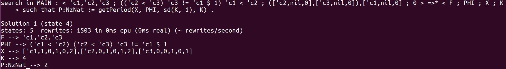
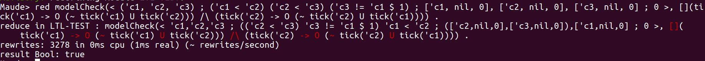

## Periodic scheduling

`Order`: search [1] < ('c1, 'c2, 'c3) ; ('c1 < 'c2) ('c2 < 'c3) ('c3 != 'c1 $ 1) ; ['c1, nil, 0], ['c2, nil, 0], ['c3, nil, 0] ; 0 > =>* < F ; PHI ; X ; K > such that P:NzNat := getPeriod(X, PHI, sd(K, 1), K) .

`Expected Result`: 

## Dead Lock

`Order`: search[,3] < ('in1, 'in2, 'out, 'step1, 'step2, 'step3, 'tmp, 'tmp2) ; ('out < 'tmp2) ('step1 < 'step3) ('step2 < 'step3) ('tmp < 'out) ('in1 <= 'step1) ('in2 <= 'step2) ('step3 <= 'out) ('tmp2 != 'tmp $ 1) ('tmp != 'in1 + 'in2) ; ['in1, nil, 0], ['in2, nil, 0], ['out, nil, 0], ['step1, nil, 0], ['step2, nil, 0], ['step3, nil,0], ['tmp, nil, 0], ['tmp2, nil, 0] ; 0 > =>! S:CCSLState .

`Expected Result`: `6 solutions` .

## LTL

`Order`: red modelCheck(< ('c1, 'c2, 'c3) ; ('c1 < 'c2) ('c2 < 'c3) ('c3 != 'c1 $ 1) ; ['c1, nil, 0], ['c2, nil, 0], ['c3, nil, 0] ; 0 >,  -> O (~ tick('c1) U tick('c2))) /\ (tick('c2) -> O (~ tick('c2) U tick('c1)))) .

`Expected Result`:  

## Specific Schedule

`Order`: rew[50] [ < ('in1, 'in2, 'out, 'step1, 'step2, 'step3, 'tmp, 'tmp2) ; ('out < 'tmp2) ('step1 < 'step3) ('step2 < 'step3) ('tmp < 'out) ('in1 <= 'step1) ('in2 <= 'step2) ('step3 <= 'out) ('tmp2 != 'tmp $ 1) ('tmp != 'in1 + 'in2) ; ['in2, nil, 0], ['in2, nil, 0], ['out, nil, 0], ['step1, nil, 0], ['step2, nil, 0], ['step3, nil,0], ['tmp, nil, 0], ['tmp2, nil, 0] ; 0 >, lazy('step1, 'step2) ] .

`Expected Result`: 
