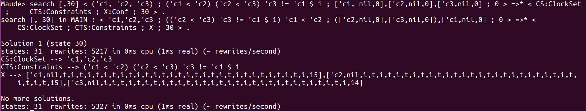
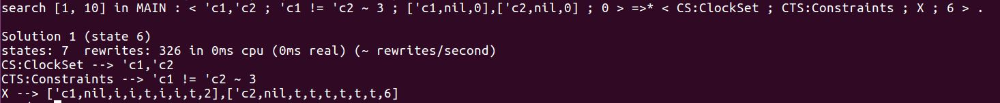
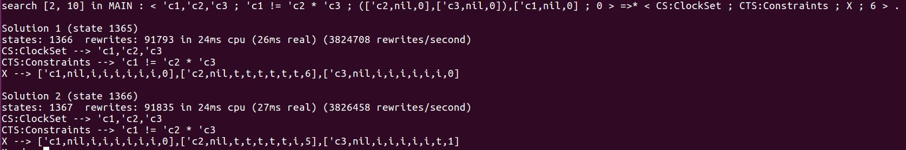
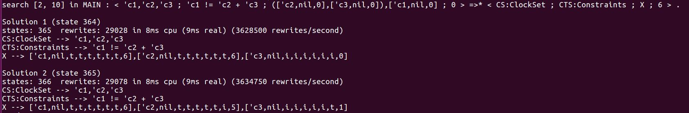
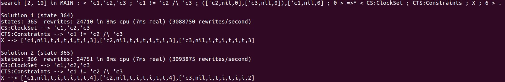
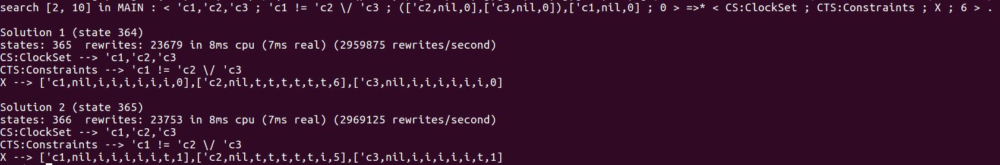
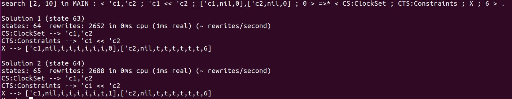
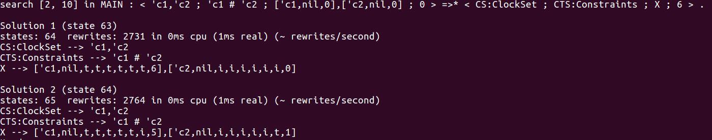
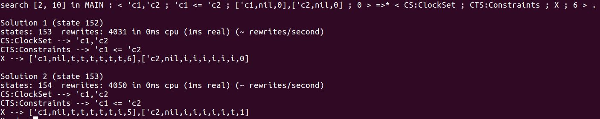
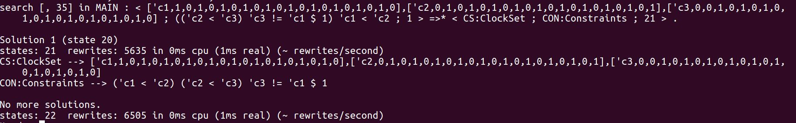

## TestCase For ccsl.maude

### Case 1(Precedence and Delay):
   
`Order`: search [,30] < (’c1, ’c2, ’c3) ; (’c1 < ’c2) (’c2 < ’c3) ’c3 != ’c1 $ 1 ; [’c1,nil,0],[’c2,nil,0],[’c3,nil,0] ; 0 > =>* < CS:ClockSet ; CTS:Constraints ; X:Conf ; 30 > .

`Expected Result`: 

### Case 2(Periodicity):

`Order`: search [1, 10] < ('c1, 'c2) ; ('c1 != 'c2 ~ 3) ; ['c1,nil,0],['c2,nil,0] ; 0 > =>* < CS:ClockSet ; CTS:Constraints ; X:Conf ; 6 > .

`Expected Result`: 

### Case 3(Intersection):

`Order`: search [2, 10] < ('c1, 'c2, 'c3) ; ('c1 != 'c2 * 'c3) ; ['c1,nil,0],['c2,nil,0],['c3,nil,0] ; 0 > =>* < CS:ClockSet ; CTS:Constraints ; X:Conf ; 6 > .

`Expected Result`: 

### Case 4(Union):

`Order`: search [2, 10] < ('c1, 'c2, 'c3) ; ('c1 != 'c2 + 'c3) ; ['c1,nil,0],['c2,nil,0],['c3,nil,0] ; 0 > =>* < CS:ClockSet ; CTS:Constraints ; X:Conf ; 6 > .

`Expected Result`: 

### Case 5(Infimum):

`Order`: search [2, 10] < ('c1, 'c2, 'c3) ; ('c1 != 'c2 /\ 'c3) ; ['c1,nil,0],['c2,nil,0],['c3,nil,0] ; 0 > =>* < CS:ClockSet ; CTS:Constraints ; X:Conf ; 6 > .

`Expected Result`: 

### Case 6(Supremum):

`Order`: search [2, 10] < ('c1, 'c2, 'c3) ; ('c1 != 'c2 \/ 'c3) ; ['c1,nil,0],['c2,nil,0],['c3,nil,0] ; 0 > =>* < CS:ClockSet ; CTS:Constraints ; X:Conf ; 6 > .

`Expected Result`: 

### Case 7(Subclock):

`Order`: search [2, 10] < ('c1, 'c2) ; ('c1 << 'c2) ; ['c1,nil,0],['c2,nil,0] ; 0 > =>* < CS:ClockSet ; CTS:Constraints ; X:Conf ; 6 > .

`Expected Result`: 

### Case 8(Exclusion):

`Order`: search [2, 10] < ('c1, 'c2) ; ('c1 # 'c2) ; ['c1,nil,0],['c2,nil,0] ; 0 > =>* < CS:ClockSet ; CTS:Constraints ; X:Conf ; 6 > .

`Expected Result`: 

### Case 9(Causality):

`Order`: search [2, 10] < ('c1, 'c2) ; ('c1 <= 'c2) ; ['c1,nil,0],['c2,nil,0] ; 0 > =>* < CS:ClockSet ; CTS:Constraints ; X:Conf ; 6 > .

`Expected Result`: 
---

## TestCase For verify.maude

### Case 1:
   
`Order`: search [,35] < (['c1, (1, 0, 1, 0, 1, 0, 1, 0, 1, 0, 1, 0, 1, 0, 1, 0, 1, 0, 1, 0)], ['c2, (0, 1, 0, 1, 0, 1, 0, 1, 0, 1, 0, 1, 0, 1, 0, 1, 0, 1, 0, 1)], ['c3, (0, 0, 1, 0, 1, 0, 1, 0, 1, 0, 1, 0, 1, 0, 1, 0, 1, 0, 1, 0)]) ; ('c1 < 'c2) ('c2 < 'c3) ('c3 != 'c1 $ 1) ; 1 > =>* < CS:ClockSet ; CON:Constraints ; 21 > .

`Expected Result`: 
